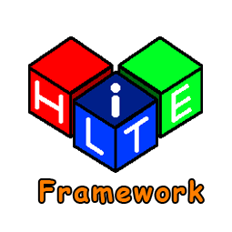

**HLITE Framework (High Lightweight Graphical Framework)**

**HLITE** is an abbreviation for **High Lightweight** which refers to a **lightweight framework for graphics** **HLITE** is written in **C++20** and powered by **OpenGL** (**Raylib**).
The aim of creating this framework is to make graphic programming or game creation easier. Without an interface, it is not like a game engine and has a smaller size than a game engine.

HLITE is very suitable for computers with low specifications because it does not have a heavy interface when programming.

> [!IMPORTANT]
> The output is a GUI display when the application is directly run.

---

## List of contents

1. <a name="HLITE Framework">HLITE Framework</a>
2. [HLITE Features as a Framework](#hlite-features-as-a-framework)
3. [Simple HLITE Code Structure](#simple-hlite-code-structure)
4. [Example of Creating a Simple Window](#example-of-creating-a-simple-window)
5. [Terms of use of HLITE](#terms-of-use-of-hlite)
6. [Download Quick HLITE](#download-quick-hlite)
7. [Build HLITE](#build-hlite)
8. [Contributor](#contributor)
9. [HLite Learning Docs and Tools](#hlite-learning-docs-and-tools)
10. [LICENSE](#license)

---

## HLITE Features as a Framework

| Header                    | Explanation                                                                   |
| ------------------------- | ----------------------------------------------------------------------------- |
| `HLITE/Core.hpp`          | The main header is part of the HLITE code structure itself                    |
| `HLITE/Metadata.hpp`      | Is a header that works to store HLITE assets (Not for users)                  |
| `HLITE/Preprocessor.hpp`  | Header contains HLITE preprocessor                                            |
| `HLITE/File.hpp`          | File is a header that is useful for managing file I/O                         |
| `HLITE/Utility.hpp`       | Useful headers manage utilities such as shortcut keys or delays and others    |
| `HLITE/UserInterface.hpp` | Useful as a complement to the UI display feature                              |
| `HLITE/Graphics.hpp`      | Useful for setting graphic features such as particles and others              |
| `HLITE/Shader`            | Useful for setting shaders on views                                           |

More details can be found in the HLite API reference documentation.

---

## Simple HLITE Code Structure

```cpp
#include <HLITE/Core.hpp> // Mandatory header which is a HLITE structure.

/*
 * A place to create variables with global scope,
 * so that it can be accessed by all section.
*/

void HLITEMain::Init()
{
    /* 
     * Initialization section when
     * the application is first run.
    */
}

void HLITEMain::Update()
{
    /*
     * The section where the logic of variable processing, 
     * for example arithmetic, occurs when the application is running.
    */
}

void HLITEMain::Render()
{
    /*
     * The section where a GUI display or
     * an object is rendered and on the screen.
    */
}

void HLITEMain::Unload()
{
    /*
     * Section all objects that need
     * to be closed or unloaded.
    */
}
```

In this structure there are 4 main function parts `void Init();`, `void Update();`,
`void Render();`, `void Unload();` all these functions do not return a value because `void`.
Every variable that is created must be created outside the section (global scope).
Each initialization must be put in a section `void Init();`. Any updates in the logic inside `void Update();`.
Every display on the screen must be rendered in parts `void Render();`.
Every object that must be closed or unloaded must be placed in a section `void Unload();`.

> [!NOTE]
> The main code structure of HLITE is inspired by Arduino, does not use the main function, only HLITE has 4 sections.

---

##  Example of Creating a Simple Window

In the code example I create a window with width `800` and height `600`,
windows set to `false` cannot be maximized, the window background color is white.

```cpp
#include <HLITE/Core.hpp>

using namespace HLITE;

constinit CORE::Window wc(Vector2{800.0f, 600.0f},
                          "HLITE - My Window",
                          WINDOW_COLOR, false, 60);

void HLITEMain::Init() { wc.Register(); }
void HLITEMain::Update(){}
void HLITEMain::Render(){}
void HLITEMain::Unload(){}
```

> [!TIP]
> More code examples can be seen in the HLITE Examples section.

---

## Terms of use of HLITE

These conditions apply to those who want to become a contributor or only use HLITE. The following are the conditions:

- Already understand the use of **terminal** or **cmd** in commands.
- Understand the use of **git** to derive frameworks or contribute to HLITE development (Already have **git** too). 
- Already understand **C++** in basic terms or especially **c++20**.
- Already tried or understood and have installed it the `Raylib` library before.
- Already installed **Win64Devkit** for Windows or more precisely **gcc** compiler if other than Windows.
- Already have **cmake** as build automation.

---

## Download Quick HLITE

You can download it directly in the release section, without having to build source code and install libraries like Raylib again.

> [!TIP]
> Read the HLITE Quick Use Guide section to make it easier to compile the project.

---

## Build HLITE

HLITE can be built manually with a direct C++ compiler,
but here I have prepared CMake as build automation, So
step by step will use CMake and Ninja.


1. Clone HLITE github repository with `git`.
    ```bash
    git clone https://github.com/HLite-Technology/HLite.git
    ```

2. Move to the `HLite` directory and create a `build` directory.
    ```bash
    cd HLite
    mkdir build
    ```

3. Initialize and build `HLite` with `cmake`.
    ```bash
    cmake -S . -B build -G Ninja 
    cmake --build build
    ```

---

## Contributor

We are very open to new and experienced contributors,
as long as it fulfills the vision and mission of HLITE as a useful framework to help game developers
or in graphic programming, for example adding GUI User Interface features.
If the `pull request` matches then it will be merged into the main code, but if not then it will be rejected.

---

## HLite Learning Docs and Tools

- [HLITE Quick Use Guide](QUICK_USE.md)
- [HLITE Documentation](#)
- [HLITE Example Code](https://github.com/HLite-Technology/HLite/tree/main/example)
- [HBRICK Binary Packer](https://github.com/HLite-Technology/HBrick)

---

## LICENSE

```txt
MIT License

Copyright (c) 2026 HLite Technology

Permission is hereby granted, free of charge, to any person obtaining a copy
of this software and associated documentation files (the "Software"), to deal
in the Software without restriction, including without limitation the rights
to use, copy, modify, merge, publish, distribute, sublicense, and/or sell
copies of the Software, and to permit persons to whom the Software is
furnished to do so, subject to the following conditions:

The above copyright notice and this permission notice shall be included in all
copies or substantial portions of the Software.

THE SOFTWARE IS PROVIDED "AS IS", WITHOUT WARRANTY OF ANY KIND, EXPRESS OR
IMPLIED, INCLUDING BUT NOT LIMITED TO THE WARRANTIES OF MERCHANTABILITY,
FITNESS FOR A PARTICULAR PURPOSE AND NONINFRINGEMENT. IN NO EVENT SHALL THE
AUTHORS OR COPYRIGHT HOLDERS BE LIABLE FOR ANY CLAIM, DAMAGES OR OTHER
LIABILITY, WHETHER IN AN ACTION OF CONTRACT, TORT OR OTHERWISE, ARISING FROM,
OUT OF OR IN CONNECTION WITH THE SOFTWARE OR THE USE OR OTHER DEALINGS IN THE
SOFTWARE.
```